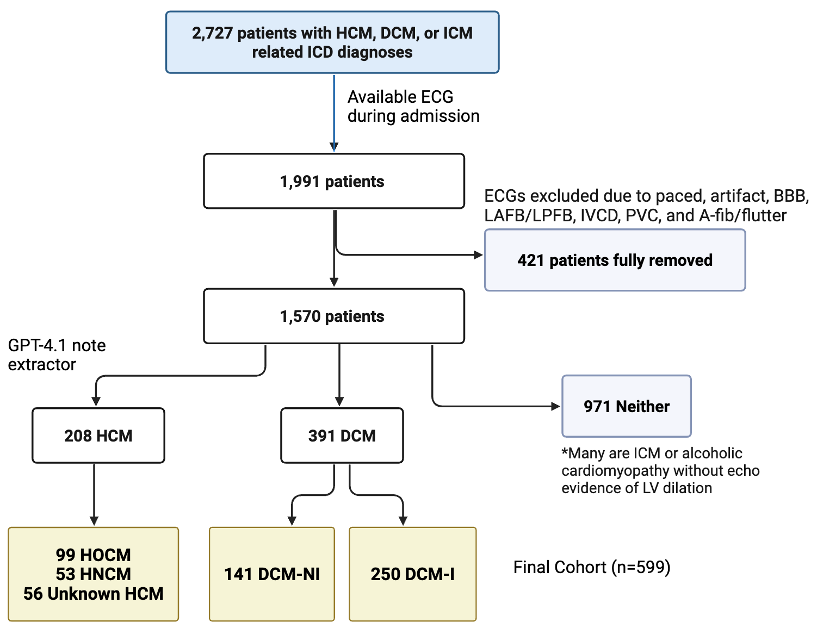

<div align="center">
<h1>An Open-Source Analysis of Cardiomyopathy Using Machine Learning and Electrocardiograms</h1>
<p>
  <a href="https://www.mdpi.com/2075-4418/16/5/719"></a>
</p>
<p>
  <a href="https://www.linkedin.com/in/arda-altintepe-584b5b306/">Arda Altintepe</a><sup>1,*</sup> &nbsp;·&nbsp;
  <a href="https://www.getcare.hackensackmeridianhealth.org/provider/asu-rustemli/1592922">Asu Rustemli</a><sup>2</sup> &nbsp;·&nbsp;
  <a href="https://amirrezavazifeh.github.io/">Amir Reza Vazifeh</a><sup>3,4</sup> &nbsp;·&nbsp;
  <a href="https://ece.princeton.edu/people/jason-w-fleischer">Jason W. Fleischer</a><sup>3,4,5</sup>
</p>
<p>
  <sup>1</sup> Horace Mann School, Bronx, NY 10471, USA<br>
  <sup>2</sup> Ocean Cardiovascular, LLC, Toms River, NJ 08755, USA<br>
  <sup>3</sup> Department of Electrical and Computer Engineering, Princeton University, Princeton, NJ 08544, USA<br>
  <sup>4</sup> Princeton Precision Health, Princeton University, Princeton, NJ 08544, USA<br>
  <sup>5</sup> Omenn-Darling Bioengineering Institute, Princeton University, Bioengineering Building, Princeton, NJ 08540, USA
</p>
<p><em>Diagnostics</em>, 2026</p>
</div>

---

## Overview

Dilated cardiomyopathy (DCM) and hypertrophic cardiomyopathy (HCM) are common heart muscle diseases associated with heart failure and sudden cardiac death. Echocardiography remains the standard diagnostic tool, but access is limited in rural and resource-constrained settings. The electrocardiogram (ECG) offers an inexpensive and widely available alternative for screening.

This repository provides the **first fully open-source, reproducible pipeline** for ECG-based cardiomyopathy classification, built entirely on the publicly available [MIMIC-IV](https://physionet.org/content/mimiciv/3.1/) database. We combine standard ECG amplitude and duration features with advanced vectorcardiogram (VCG) spatial features derived via the Kors regression matrix to distinguish:

**HCM vs. non-ischemic DCM (DCM-NI)**  
**HCM vs. ischemic cardiomyopathy with LV dilation (DCM-I)**  
**Obstructive HCM (HOCM) vs. non-obstructive HCM (HNCM)**  

---

## Method

The pipeline proceeds in four stages: cohort identification, LLM-assisted label refinement, ECG/VCG feature extraction, and machine learning classification.

### 1. Cohort Identification

Hospital admissions with ICD-9/10 codes for DCM, ischemic cardiomyopathy, and HCM are extracted from MIMIC-IV (v3.1). Patients are linked to their 12-lead ECGs from MIMIC-IV-ECG (v1.0), retaining only ECGs recorded during the hospital stay of diagnosis. ECGs with paced rhythms, bundle branch blocks, fascicular blocks, intraventricular conduction defects, prominent PVCs, atrial fibrillation, or atrial flutter are excluded.



### 2. LLM-Assisted Diagnosis Labels

ICD codes alone are unreliable for cardiomyopathy subtyping. We use GPT-4.1 (temperature = 0) to extract structured labels from MIMIC-IV-Note discharge reports in a three-stage pipeline:

  **Stage 1** — Classify each admission as HCM, DCM (echocardiogram-verified LV dilation + reduced EF), or Neither, and extract the reported LVEF.
  
  **Stage 2 (HCM only)** — Determine LVOT obstruction status (HOCM / HNCM / Unknown) and whether a septal reduction procedure occurred during the admission.
  
  **Stage 3 (DCM only)** — Determine ischemic status (DCM-I / DCM-NI / Unknown) based on documented CAD, prior MI, revascularization, or explicit ischemic terms.

Each classification is accompanied by supporting verbatim quotes from the discharge text.

!(Figures/Figure1.png)

### 3. ECG & VCG Feature Extraction

!(Figures/Figure3.png)

**Standard ECG features** are computed per lead using NeuroKit2 (prominence-based delineation): median Q, R, S, T, and P amplitudes referenced to the isoelectric PR baseline; R/S and T/R amplitude ratios; QRS area; ST slope; durations (QRS, QT, QTc, JT, RR, PR, P-wave, T-wave); and Fourier-derived spectral features (mean and median frequency, skewness, kurtosis).

**Vectorcardiogram features** are derived by projecting eight independent leads through the Kors regression matrix into 3D (X, Y, Z) space. A mean heartbeat is constructed per record, and global P-wave, QRS, and T-wave boundaries are determined via median relative offsets across leads using discrete wavelet transforms and amplitude gating. VCG features include: QRS-T angles (spatial peak, mean, eigenvector-based, and planar projections), ventricular gradient magnitude and orientation, SVD-based loop geometry (dipolar/non-dipolar energy ratios, eigenvector amplitudes), spatial ventricular activation time, time–voltage integrals, and P-loop spatial features.

The total feature set comprises **14 lead-specific amplitude and Fourier features × 12 leads**, **30 global interval/axis features**, **11 Boolean machine-generated ECG labels**, and **41 VCG-derived features**.

### 4. Machine Learning Classification

Two classifiers are evaluated for each binary task with 5-fold stratified cross-validation:

**L1-penalized Logistic Regression** (C = 0.1, liblinear solver, balanced class weights)
**XGBoost** (200 trees, max depth 4, learning rate 0.05)

For HOCM vs. HNCM, a reduced set of 15 features is used due to lower sample size. Performance is reported as AUC-ROC, AUC-PR, and sensitivity/specificity at the Youden threshold.

---

## Result

The final cohort comprises **599 patients**: 208 HCM (99 HOCM, 53 HNCM, 56 unknown obstruction status) and 391 DCM (250 DCM-I, 141 DCM-NI).

### Key ECG Findings

Both DCM subtypes exhibited lower QRS amplitudes (especially DCM-I in precordial leads) and right-posterior ventricular gradient orientation. HCM had higher amplitudes, more spatially complex and larger T-loops, and preserved leftward ventricular gradient orientation closer to normal ECGs.

!(Figures/Figure5.png)

HOCM showed stronger leftward electrical activity (higher R/S ratios in all left-lateral and inferior leads) and more dipolar, or planar, QRS loops. HNCM had higher non-dipolar QRS energy, which can suggest more spatially dispersed depolarization, and had a wider angle between the first QRS and T eigenvectors.

!(Figures/Figure4.png)

!(Figures/Figure6.png)


### Classification Performance

| Task | Model | AUC-ROC | AUC-PR | Sensitivity | Specificity |
|------|-------|---------|--------|-------------|-------------|
| HCM vs. DCM-I | Logistic Regression | **0.92** | 0.88 | 0.86 | 0.84 |
| HCM vs. DCM-I | XGBoost | 0.91 | 0.87 | 0.83 | 0.85 |
| HCM vs. DCM-NI | Logistic Regression | **0.90** | 0.85 | 0.81 | 0.84 |
| HCM vs. DCM-NI | XGBoost | 0.88 | 0.82 | 0.83 | 0.79 |
| HOCM vs. HNCM | XGBoost | **0.81** | 0.89 | 0.80 | 0.74 |
| HOCM vs. HNCM | Logistic Regression | 0.75 | 0.84 | 0.76 | 0.64 |

!(Figures/Figure7.png)
---

## Usage

### Prerequisites

All data are obtained from the publicly available [MIMIC-IV](https://physionet.org/content/mimiciv/3.1/) ecosystem on PhysioNet. Access requires completing a data-use agreement. The following modules are needed:

- [MIMIC-IV v3.1](https://physionet.org/content/mimiciv/3.1/) — `patients.csv.gz`, `admissions.csv.gz`, `diagnoses_icd.csv.gz`
- [MIMIC-IV-ECG v1.0](https://physionet.org/content/mimic-iv-ecg/1.0/) — ECG waveform files and `machine_measurements.csv`, `record_list.csv`
- [MIMIC-IV-Note v2.2](https://physionet.org/content/mimic-iv-note/2.2/) — `discharge.csv.gz`

### Python Dependencies

```
pandas, numpy, scipy, scikit-learn, xgboost, wfdb, neurokit2, 
statsmodels, pydantic, openai, matplotlib, tqdm
```

### Running the Pipeline

Scripts are numbered in execution order:

1. **`1initial_preprocessing.py`** — Builds the initial cohort from ICD codes, links ECGs, and extracts discharge notes.
2. **`2GPT4.1_diagnoses.py`** — Runs the LLM diagnosis pipeline on discharge notes (requires an OpenAI API key) and merges refined labels back into the cohort.
3. **`4ECG_features.py`** — Extracts standard ECG features from WFDB waveform records for the full cohort.
4. **`4VCG_features.py`** — Extracts vectorcardiogram features using the Kors regression matrix and SVD-based loop analysis.
5. **`6final_preprocessing.py`** — Selects one ECG per patient, encodes demographics, and assembles the final feature matrix.
6. **`8controls(visual).py`** — Extracts and processes 500 electrically normal control ECGs using the same feature pipeline (used for visual comparison only).
7. **`9machine_learning.py`** — Trains and evaluates Logistic Regression and XGBoost classifiers; generates ROC and PR curve figures.
8. **`stat.py`** — Runs Mann–Whitney U and Fisher exact tests with FDR correction across all features.

> **Note:** Because MIMIC-IV is distributed under a data-use agreement, raw or preprocessed patient-level data cannot be redistributed in this repository. Researchers can obtain the same data free of charge by completing the [PhysioNet credentialing process](https://physionet.org/settings/credentialing/).

---

## Contact

For questions or issues, please contact [arda.altintepe08@gmail.com].

---

## Citation

```bibtex
@Article{diagnostics16050719,
AUTHOR = {Altintepe, Arda and Rustemli, Asu and Vazifeh, Amir Reza and Fleischer, Jason W.},
TITLE = {An Open-Source Analysis of Cardiomyopathy Using Machine Learning and Electrocardiograms},
JOURNAL = {Diagnostics},
VOLUME = {16},
YEAR = {2026},
NUMBER = {5},
ARTICLE-NUMBER = {719},
URL = {https://www.mdpi.com/2075-4418/16/5/719},
PubMedID = {41827995},
ISSN = {2075-4418},
DOI = {10.3390/diagnostics16050719}
}
